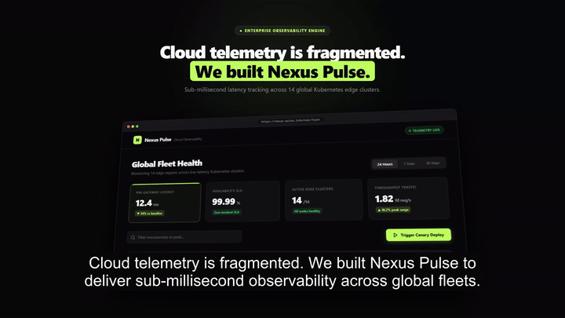
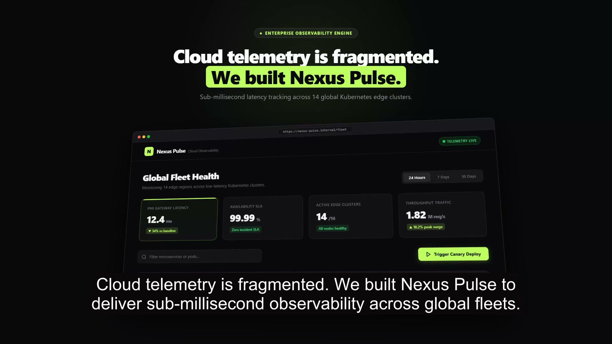

<p align="center">
  <a href="showcase/walkthrough_demo.mp4">
    
  </a>
</p>

<h1 align="center">Walkthrough</h1>

<p align="center">
  <strong>Turn any web codebase into a ScreenStudio-grade product demo video — autonomously.</strong><br>
  Live browser automation · Physics macOS cursor · Clamped camera zooms · Neural voiceover · Acoustic SFX room · Shutter motion blur · Quality oracle
</p>

<p align="center">
  <a href="LICENSE"></a>
  
  
  
  
  
  
</p>

<p align="center">
  <a href="#-quickstart">Quickstart</a> •
  <a href="#-the-architecture-triad">Architecture</a> •
  <a href="#-motion-physics-library">Motion Library</a> •
  <a href="#-sound-palette--reverb-room">Sound Engine</a> •
  <a href="#-quality-oracle">Quality Oracle</a> •
  <a href="#-cli-reference">CLI Reference</a> •
  <a href="#-agent-skill-setup">Agent Skill</a>
</p>

---

## 🎬 Showcase Demo

> **Watch the full 1080p 60fps master showcase**: [`showcase/walkthrough_demo.mp4`](showcase/walkthrough_demo.mp4)  
> Generated 100% autonomously from local code.

<p align="center">
  <a href="showcase/walkthrough_demo.mp4">
    
  </a>
</p>

---

## ⚡ The Architecture Triad

Walkthrough is **not a passive screen recorder** and **not a slide generator**. It unifies three distinct disciplines into a single autonomous pipeline:

```
                      ┌──────────────────────────────────────┐
                      │          WALKTHROUGH ENGINE          │
                      └──────────────────┬───────────────────┘
                                         │
         ┌───────────────────────────────┼───────────────────────────────┐
         ▼                               ▼                               ▼
┌──────────────────┐           ┌──────────────────┐           ┌──────────────────┐
│  LIVE AUTOMATION │           │  ONETAKE PHYSICS │           │  EDITORIAL BRAG  │
│  Playwright Real │           │  Pure f(t) Math  │           │  Modern Swiss    │
│  Browser Engine  │           │  & Acoustic SFX  │           │  3-Act Structure │
└──────────────────┘           └──────────────────┘           └──────────────────┘
  • Live dev server              • 39 motion primitives         • Act 1: The Hook
  • DOM introspection            • Shutter motion blur          • Act 2: The Walkthrough
  • macOS pointer physics        • Impulse reverb room          • Act 3: The Receipt
  • 1.14x clamped camera         • Quality rhythm oracle        • Pause-centered xfades
```

1. **Live Browser Automation (Playwright)**: Inspects codebases, starts dev servers, drives live applications, injects Apple-matched macOS pointers with SmootherStep glide paths, and executes clamped camera zooms.
2. **onetake Motion & Acoustic Physics**: 39 mathematical motion primitives ($f(t)$ without mutable runtime state), frame-by-frame 180° shutter motion blur in linear light, physical sound effects (wood, air, glass, sub) in a shared impulse response room, and an automated quality oracle that fails slideshows before humans watch.
3. **Editorial Brag Polish**: Modern enterprise narrative pacing (Hook $\to$ Proof $\to$ Receipt), Swiss typography, monospace telemetry counters, and mathematically aligned audio breathing dissolves.

---

## 🚀 Quickstart

### Prerequisites
- **Node.js** $\ge 18$
- **Python** $\ge 3.9$
- **FFmpeg** with `libass` / `subtitles` filter

### 1. Clone & Install

```bash
git clone https://github.com/narain-karti/Walkthrough.git
cd Walkthrough
npm install
npx playwright install chromium
pip install -r requirements.txt
```

### 2. Run the Flagship Showcase in One Command

```bash
walkthrough demo
# Or: npm run demo
```

The pipeline executes end-to-end:
1. `audio_synthesizer.py`: Neural speech narration + 500ms breathing gaps
2. `sfx_palette.py`: Generates tactile mouse clicks, air whooshes, and sub impacts in the acoustic room
3. `render_scenes.js`: Records Act 1 Hook and Act 3 Outro motion templates
4. `record.js`: Drives the live browser app with physics cursor and camera
5. `compositor.py`: Mathematically centers xfade dissolves in pauses, layers audio/SFX, and burns subtitles
6. `verify.py`: Runs the Quality Oracle verification suite on the final MP4

Output: [`flagship-output/flagship_showcase.mp4`](flagship-output/flagship_showcase.mp4)

---

## 📋 Storyboard Schema (`storyboard.json`)

Drive any web application by specifying interactive beats:

```json
{
  "title": "Nexus Pulse — Realtime Telemetry",
  "baseUrl": "http://localhost:5173",
  "outputDir": "./walkthrough-output",
  "steps": [
    {
      "desc": "Wide overview of cluster metrics",
      "holdMs": 5000
    },
    {
      "desc": "Select thirty-day window",
      "selector": "button#range-30d",
      "action": "click",
      "zoomOnClick": true,
      "holdMs": 4000
    },
    {
      "desc": "Filter analytics workers",
      "selector": "input#query",
      "action": "type",
      "text": "analytics-worker",
      "typeDelay": 75,
      "holdMs": 3500
    },
    {
      "desc": "Trigger canary deployment",
      "selector": "button#deploy",
      "action": "click",
      "zoomOnClick": true,
      "holdMs": 5000
    }
  ]
}
```

### Storyboard Step Options
| Field | Type | Default | Description |
|---|---|---|---|
| `selector` | `string` | — | CSS selector to target with cursor and camera |
| `action` | `"click" \| "type"` | — | Action to perform on the selected element |
| `text` | `string` | `""` | String to type when `action: "type"` |
| `typeDelay` | `number` | `85` | Keystroke delay in milliseconds |
| `zoomOnClick` | `boolean` | `false` | Smoothly zooms camera to 1.14× focused on element |
| `holdMs` | `number` | `4000` | Duration to hold on the frame after action |

---

## 🎨 Motion Physics Library (`lib/motion.js` v2.0.0)

Every visual transform is a pure function of time: `seek(t)` called twice always returns the exact same frame.

```javascript
const WM = require('walkthrough/lib/motion');

// Smooth spring evaluation at time tau (damping ratio zeta, angular frequency omega)
const s = WM.spring(tau, 0.7, 18);

// SwiftUI-modeled springs: 'smooth', 'snappy', 'bouncy'
const k = WM.swiftSpring(tau, 'snappy');

// Clamped camera interpolation with ease curves
const cam = WM.camera(t, [
  { t: 0.0, x: 0, y: 0, zoom: 1.0 },
  { t: 2.0, x: 120, y: 80, zoom: 1.14, curve: WM.ease.cubicInOut }
]);
```

### Complete Motion Primitives

| Category | Functions | Purpose |
|---|---|---|
| **Curves** | `ease.*`, `bezier`, `tween`, `t80`, `spring`, `springVel`, `ring`, `settle`, `spline`, `rng` | Analytical kinematics without numeric drift |
| **Entrances** | `wordRise`, `letterDrop`, `popIn`, `liftOut`, `maskRise`, `typeOn`, `tick`, `flyThrough` | Elements enter via mass and momentum |
| **Carries** | `morphRect`, `iris`, `zoomThrough`, `hop`, `gather`, `ribbon`, `seal`, `staccato` | Section transitions where visual anchors survive |
| **Contact** | `impact`, `impactSplit`, `press`, `cursor`, `squash`, `sim.{magnet, follow, jelly}` | Tactile physical feedback on clicks |
| **Camera** | `camera`, `view`, `dof`, `whip`, `shake`, `drift`, `lattice`, `project`, `unproject` | Clamped 3D operator perspective tracking |
| **Fluid** | `swiftSpring`, `lightField`, `ripple`, `silk`, `carouselLoop` | Ambient noise fields, ripples, and continuous belts |

---

## 🔊 Sound Palette & Reverb Room (`engine/sfx_palette.py`)

A product demo without physical sound feels synthetic. Walkthrough synthesizes realistic acoustic materials in a shared stereo impulse response room ($T_{60} = 0.85\text{s}$):

- **`wood`**: Calibrated body resonance + ultra-short snap for mouse clicks and keyboard keystrokes.
- **`air`**: Directional whoosh sweeping center frequencies ($f_0 \to f_1$) during camera zooms and card glides.
- **`glass`**: Inharmonic struck tones for toasts, notifications, and feature reveals.
- **`sub`**: Deep, gently-saturated low bass impact for scene transitions and act landings.
- **`bubble`**: Rounded closing resonance for toggle switches and chip selectors.
- **`wobble`**: Elastic jelly vibrato for dynamic micro-interactions.

```bash
# Listen to the synthetic sound palette
python engine/sfx_palette.py --demo flagship-output/sfx_demo.wav
```

---

## 🔍 Quality Oracle (`engine/verify.py`)

Slideshows are rejected before a human has to watch. Walkthrough's automated oracle inspects rendered videos across four rigorous quality legs:

```bash
python engine/verify.py flagship-output/flagship_showcase.mp4 --shots 0,8.2,14.0,18.4,24.5
```

```text
  flagship_showcase.mp4 — 944 frames, 30 fps, 31.5s
  Energy:  █        ▁  ▁▁▁                             ▁              

  ✓ PASS  cadence      shot lengths [8.2, 5.8, 4.4, 6.1, 6.97]  CV 0.20 (need >= 0.20)
  ✓ PASS  rest         still 0.84  longest quiet 4.6s (need >= 1.0s)
  ⚠ WARN  burst        no burst — fine for concepts without hits
  ✓ PASS  energy       variation 1.22 (advisory, >= 0.35)
  ✓ PASS  audio        peak -5.3dBFS  clipped 0  quiet 0.199

  ✓ Verdict: PASS
```

- **Cadence**: Ensures shot lengths vary by coefficient of variation ($CV \ge 0.20$). Equal shot lengths read as boring slides.
- **Rest**: Guarantees at least 25% of frames are calm and includes at least one quiet rest stretch ($\ge 1.0\text{s}$). Stillness makes bursts land.
- **Audio**: Verifies audio peak $\le -3.0\text{ dBFS}$, zero clipped samples, and $\ge 15\%$ quiet breathing frames.
- **Energy Map**: Generates an ASCII frame-to-frame diff density profile across the entire timeline.

---

## 🛠 CLI Reference

```bash
# Full 3-Act showcase demo end-to-end
walkthrough demo

# Record live browser walkthrough from storyboard
walkthrough run [storyboard.json]

# Synthesize neural voiceover narration
walkthrough audio

# Generate acoustic sound effects in impulse room
walkthrough sfx [out.wav]

# Render Act 1 and Act 3 editorial motion scenes
walkthrough scenes

# Assemble master 1080p MP4 with camera dissolves & subtitles
walkthrough composite

# Audit video pacing and rhythm with Quality Oracle
walkthrough verify <video.mp4> [--shots t0,t1,...]

# Render composition with 180° shutter motion blur
walkthrough shutter <comp.html> [--fps 30] [--out film.mp4]

# Display reference manual
walkthrough help
```

---

## 🤖 Agent Skill Setup

Walkthrough is packaged as an autonomous skill for **Antigravity**, **Claude Code**, and compatible agent runtimes.

### Global Installation

```bash
# For Antigravity / Gemini Agents:
cp -r skills/walkthrough ~/.gemini/config/skills/walkthrough

# For Workspace-local Agents:
mkdir -p .agents/skills
cp -r skills/walkthrough .agents/skills/walkthrough
```

### Slash Command Usage

In any web project repository, ask your agent:

```
/walkthrough
"Record a product walkthrough of this dashboard"
"Make a 30-second feature demo of the signup flow"
"Audit the rhythm of our walkthrough video"
```

The agent will autonomously:
1. Detect dev scripts and open ports
2. Author an interactive storyboard
3. Synthesize voiceover and tactile SFX
4. Drive the browser, record 1080p video, and stitch dissolves
5. Verify the cut with the Quality Oracle

---

## 📂 Repository Layout

```
Walkthrough/
├── bin/
│   └── walkthrough.js              # Universal CLI executable
├── engine/
│   ├── record.js                   # Playwright browser recorder
│   ├── cursor-overlay.js           # macOS cursor kinematics & spring tracking
│   ├── camera-engine.js            # Clamped viewport pan and camera zooms
│   ├── audio_synthesizer.py        # edge-tts voiceover + timing manifest
│   ├── sfx_palette.py              # Physical sound materials + impulse reverb room
│   ├── render_scenes.js            # Playwright editorial template recorder
│   ├── renderer.py                 # Frame-by-frame 180° shutter motion blur
│   ├── compositor.py               # FFmpeg xfade dissolves, SFX mix, & subtitles
│   └── verify.py                   # Quality oracle & ASCII energy map
├── lib/
│   └── motion.js                   # 39 pure mathematical motion primitives (v2.0.0)
├── templates/
│   ├── act1_intro.html             # Act 1 Hook 3D card composition
│   └── act3_outro.html             # Act 3 Outro terminal receipt composition
├── test/
│   └── motion.test.js              # Unit verification suite for motion library
├── showcase/
│   ├── walkthrough_demo.mp4        # Production master showcase video (1080p60)
│   ├── poster.jpg                  # Hero social poster frame
│   ├── preview.gif                 # Animated GitHub preview
│   └── storyboard.json             # Reference showcase storyboard
├── skills/walkthrough/
│   └── SKILL.md                    # Official agent skill specification
├── package.json                    # npm configuration & scripts
├── requirements.txt                # Python runtime dependencies
└── LICENSE                         # MIT License
```

---

## 🏆 Hard Rules

- **The cause must be visible**: The cursor or interaction trigger must lead every reaction on screen. Never let a page react to nothing.
- **Never cut on a metronome**: Vary hold lengths by at least 3× so the video has natural breathing cadence.
- **Never let the frame always be in motion**: Stillness makes the bursts land.
- **Pause-centered dissolves**: Video cuts occur inside the 500ms voiceover breathing pauses; never cut across active speech.
- **Shared acoustic room**: Sound effects share a unified impulse reverb environment; never use disconnected dry sine beeps.
- **Deterministic execution**: `seek(t)` called twice always produces the identical frame.

---

## 📄 License

MIT © [Narain Karti](https://github.com/narain-karti)
