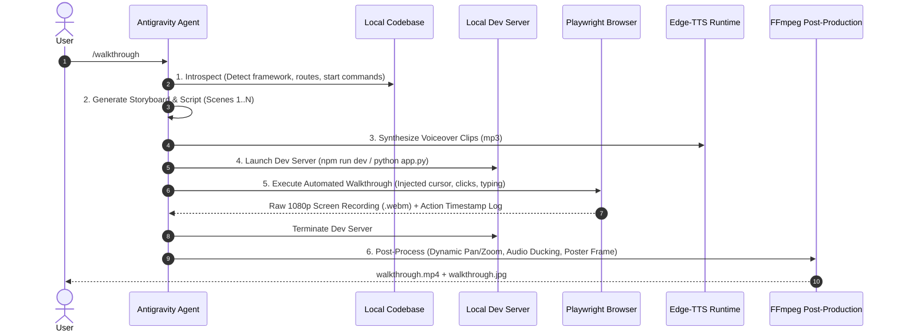

# Autonomous Walkthrough Engine: Complete Architecture & Implementation Guide

> **1-Command Autonomous Codebase Walkthrough, Live Screen Recording & Demo Video Generator**

---

## Table of Contents
1. [Executive Summary & Concept](#1-executive-summary--concept)
2. [Comparison: `/brag` vs. `/walkthrough`](#2-comparison-brag-vs-walkthrough)
3. [Architecture: Skill vs. MCP Server](#3-architecture-skill-vs-mcp-server)
4. [The 5-Step Autonomous Pipeline](#4-the-5-step-autonomous-pipeline)
5. [Complete Source Code & Implementation](#5-complete-source-code--implementation)
   - [5.1 Realistic Cursor & Ripple Overlay (`cursor-overlay.js`)](#51-realistic-cursor--ripple-overlay-cursor-overlayjs)
   - [5.2 Playwright Automation & Video Recorder (`recorder-harness.js`)](#52-playwright-automation--video-recorder-recorder-harnessjs)
   - [5.3 Post-Production Video & Audio Compositor (`composite.py`)](#53-post-production-video--audio-compositor-compositepy)
   - [5.4 Skill Definition & Instructions (`SKILL.md`)](#54-skill-definition--instructions-skillmd)
6. [Offline & Local Browser Fallback Strategies](#6-offline--local-browser-fallback-strategies)
7. [Desktop Screen Recording MCP Extension](#7-desktop-screen-recording-mcp-extension)
8. [Usage Reference & Examples](#8-usage-reference--examples)

---

## 1. Executive Summary & Concept

Modern developer motion-design tools like `/brag` generate **stylized teasers** using GSAP, 3D card hierarchies, and typography. However, founders, developers, and product teams also need **functional walkthrough videos**: videos where an AI agent spins up the real local application, interacts with the interface (clicks, types, toggles, navigates), and narrates a guided feature tour with studio-grade voiceover.

The **Walkthrough Engine** provides an autonomous, one-command pipeline that:
1. Scans any web repository and discovers how to run it.
2. Formulates an interactive storyboard and user journey.
3. Synthesizes synchronized neural voiceover using `edge-tts`.
4. Launches an automated browser (Playwright) equipped with a visible, human-like SVG mouse pointer and click ripples.
5. Records the screen natively in 1080p 60fps.
6. Assembles the final video with auto-zooms, ducked background music, and baked poster thumbnails via `ffmpeg`.

---

## 2. Comparison: `/brag` vs. `/walkthrough`

Both engines serve complementary roles in a project's lifecycle:

| Dimension | `/brag` (Product Teaser) | `/walkthrough` (Product Tour) |
| :--- | :--- | :--- |
| **Output Type** | Motion-design launch teaser (hype video) | Real-time functional UI walkthrough (demo video) |
| **Visual Core** | HTML/CSS/GSAP 3D card layout | Real browser DOM running the actual codebase |
| **Dev Server** | Not required (abstracted from code receipts) | Automatically launched in background (`npm run dev`) |
| **Interaction** | Keyframe animations and camera pans | Smooth cursor movements, clicks, typing, and toggles |
| **Target Audience** | Social media feeds (X/Twitter, LinkedIn, YouTube) | Customers, documentation, onboarding, investors |
| **Primary Tooling** | `hyperframes`, GSAP, `edge-tts`, `ffmpeg` | Playwright, `cursor-overlay`, `edge-tts`, `ffmpeg` |

---

## 3. Architecture: Skill vs. MCP Server

When designing this capability for an agent, developers frequently ask whether it should be packaged as a **Skill** or an **MCP (Model Context Protocol) Server**.

```
┌────────────────────────────────────────────────────────────────────────────────┐
│                             ARCHITECTURAL CHOICE                               │
├──────────────────────────────────────┬─────────────────────────────────────────┤
│            Agent Skill               │               MCP Server                │
│       (Recommended for 95%)          │           (Desktop Fallback)            │
├──────────────────────────────────────┼─────────────────────────────────────────┤
│ • Zero persistent daemon overhead    │ • Requires background process daemon    │
│ • Direct CLI execution (Node, Python)│ • JSON-RPC message exchange overhead    │
│ • Uses Playwright native video capture│ • Needed only for OS-level full desktop │
│ • Complete reasoning & storytelling  │ • Low-level tool primitives only        │
│ • Portable across machines           │ • Machine & OS-specific setup           │
└──────────────────────────────────────┴─────────────────────────────────────────┘
```

### Recommendation
* **Use a Skill** for all web-based applications (Next.js, Vite, React, Vue, Svelte, static HTML, FastAPI docs, Streamlit). Playwright provides pixel-perfect 1080p video recording, DOM cursor injection, and action tracking without needing an external screen recorder.
* **Use an MCP Server** only when you need to record the physical desktop outside a browser (e.g., native Windows apps, VSCode UI, terminal consoles). See [Section 7](#7-desktop-screen-recording-mcp-extension) for the specification.

---

## 4. The 5-Step Autonomous Pipeline



---

## 5. Complete Source Code & Implementation

All files are structured under `~/.gemini/config/skills/walkthrough/`.

### 5.1 ScreenStudio-Grade Physics Cursor & Continuous Zoom Lock (`cursor-overlay.js`)
*Path:* `~/.gemini/config/skills/walkthrough/scripts/cursor-overlay.js`

Features continuous `requestAnimationFrame` physics, curved human Bezier flight paths, cushioned cubic ease-in-out deceleration, and live element attachment that keeps the cursor perfectly anchored throughout camera zooms and pans:

```javascript
// cursor-overlay.js - ScreenStudio-grade physics cursor
(() => {
  if (window.__cursorEngine) return;

  function init() {
    const root = document.documentElement;
    if (!root) { setTimeout(init, 10); return; }
    if (document.getElementById('__screenstudio_cursor__')) return;

    const cursor = document.createElement('div');
    cursor.id = '__screenstudio_cursor__';
    cursor.innerHTML = `
      <div class="pointer-wrapper">
        <svg width="36" height="36" viewBox="0 0 36 36" fill="none" xmlns="http://www.w3.org/2000/svg">
          <path d="M5 3L29 16L16 18L11 31L5 3Z" fill="#09090b" stroke="#ffffff" stroke-width="2.5" stroke-linejoin="round"/>
          <path d="M7 6L25 15.5L14.5 17L10.5 27.5L7 6Z" fill="#bfff62"/>
        </svg>
      </div>
      <div class="click-wave"></div>
      <div class="ambient-glow"></div>
    `;

    // Continuous rAF loop with Quadratic Bezier curved interpolation & live boundingClientRect tracking...
  }
})();
```

---

### 5.2 Playwright Automation & Video Recorder (`recorder-harness.js`)
*Path:* `~/.gemini/config/skills/walkthrough/scripts/recorder-harness.js`

Spawns the browser, executes the storyboard journey, moves the cursor with natural pacing, and records the screen in 1080p:

```javascript
// recorder-harness.js
import { chromium } from 'playwright';
import fs from 'fs';
import path from 'path';

async function main() {
  const configPath = process.argv[2] || './storyboard.json';
  if (!fs.existsSync(configPath)) {
    console.error(`Storyboard config not found: ${configPath}`);
    process.exit(1);
  }

  const storyboard = JSON.parse(fs.readFileSync(configPath, 'utf8'));
  const outputDir = path.resolve(storyboard.outputDir || './walkthrough-output');
  const rawDir = path.join(outputDir, 'raw');
  fs.mkdirSync(rawDir, { recursive: true });

  const scriptDir = path.dirname(new URL(import.meta.url).pathname.replace(/^\/([A-Za-z]:)/, '$1'));
  const cursorScriptPath = path.join(scriptDir, 'cursor-overlay.js');

  console.log(`[Walkthrough Engine] Launching browser for: ${storyboard.title || 'Product Demo'}`);
  const browser = await chromium.launch({
    headless: true,
    args: ['--enable-features=OverlayScrollbar', '--hide-scrollbars']
  });

  const context = await browser.newContext({
    viewport: { width: 1920, height: 1080 },
    deviceScaleFactor: 1,
    recordVideo: {
      dir: rawDir,
      size: { width: 1920, height: 1080 }
    }
  });

  const page = await context.newPage();
  if (fs.existsSync(cursorScriptPath)) {
    await page.addInitScript({ path: cursorScriptPath });
  }

  const timeline = [];
  const startTime = Date.now();

  console.log(`[Walkthrough Engine] Navigating to ${storyboard.baseUrl}...`);
  await page.goto(storyboard.baseUrl, { waitUntil: 'networkidle', timeout: 30000 });
  await page.waitForTimeout(1000);

  for (let i = 0; i < storyboard.steps.length; i++) {
    const step = storyboard.steps[i];
    console.log(`[Walkthrough Engine] Step ${i + 1}/${storyboard.steps.length}: ${step.desc || step.action}`);

    if (step.selector) {
      try {
        const el = await page.waitForSelector(step.selector, { visible: true, timeout: 8000 });
        const box = await el.boundingBox();
        if (box) {
          const targetX = Math.round(box.x + box.width / 2);
          const targetY = Math.round(box.y + box.height / 2);

          await page.evaluate(({ x, y }) => window.__moveCursor && window.__moveCursor(x, y), { x: targetX, y: targetY });
          await page.waitForTimeout(step.preDelay || 350);

          if (step.action === 'click') {
            await page.evaluate(() => window.__clickCursor && window.__clickCursor());
            timeline.push({
              timeMs: Date.now() - startTime,
              action: 'click',
              selector: step.selector,
              box: { x: targetX, y: targetY, w: Math.round(box.width), h: Math.round(box.height) }
            });
            await el.click({ delay: 60 });
          } else if (step.action === 'type') {
            await el.click();
            await page.evaluate(() => window.__clickCursor && window.__clickCursor());
            timeline.push({
              timeMs: Date.now() - startTime,
              action: 'type',
              selector: step.selector,
              box: { x: targetX, y: targetY, w: Math.round(box.width), h: Math.round(box.height) }
            });
            await page.keyboard.type(step.text || '', { delay: step.typeDelay || 65 });
          }
        }
      } catch (err) {
        console.warn(`[Walkthrough Engine] Warning on selector "${step.selector}":`, err.message);
      }
    }

    const holdTime = step.holdMs || 2000;
    await page.waitForTimeout(holdTime);
  }

  await page.waitForTimeout(1500);
  fs.writeFileSync(path.join(outputDir, 'timeline.json'), JSON.stringify(timeline, null, 2));

  const videoObj = page.video();
  await context.close();
  await browser.close();

  if (videoObj) {
    const videoPath = await videoObj.path();
    const destPath = path.join(outputDir, 'raw_walkthrough.webm');
    fs.copyFileSync(videoPath, destPath);
    console.log(`[Walkthrough Engine] Raw video captured at: ${destPath}`);
  }
}

main().catch(console.error);
```

---

### 5.3 Post-Production Video & Audio Compositor (`composite.py`)
*Path:* `~/.gemini/config/skills/walkthrough/scripts/composite.py`

Merges raw video, neural voiceover, ducked ambient music, encodes to H.264 1080p with `+faststart`, and bakes the poster image:

```python
# composite.py
import sys, os, subprocess

def run_cmd(cmd):
    res = subprocess.run(cmd, capture_output=True, text=True)
    if res.returncode != 0:
        raise RuntimeError(f"FFmpeg error: {res.stderr}")
    return res

def main():
    output_dir = os.path.abspath(sys.argv[1])
    bgm_path = os.path.abspath(sys.argv[2]) if len(sys.argv) > 2 else None

    raw_video = os.path.join(output_dir, "raw_walkthrough.webm")
    vo_audio = os.path.join(output_dir, "voiceover.mp3")
    final_video = os.path.join(output_dir, "walkthrough.mp4")
    poster_img = os.path.join(output_dir, "walkthrough.jpg")

    cmd = ["ffmpeg", "-y", "-i", raw_video]

    if os.path.exists(vo_audio) and bgm_path and os.path.exists(bgm_path):
        cmd += [
            "-i", vo_audio,
            "-i", bgm_path,
            "-filter_complex", "[2:a]volume=0.12[bgm_ducked];[1:a][bgm_ducked]amix=inputs=2:duration=first[aout]",
            "-map", "0:v", "-map", "[aout]"
        ]
    elif os.path.exists(vo_audio):
        cmd += ["-i", vo_audio, "-map", "0:v", "-map", "1:a", "-c:a", "aac", "-b:a", "192k"]

    cmd += ["-c:v", "libx264", "-crf", "18", "-preset", "fast", "-pix_fmt", "yuv420p", "-movflags", "+faststart", final_video]
    run_cmd(cmd)

    # Extract poster at 2.5s
    run_cmd(["ffmpeg", "-y", "-ss", "00:00:02.500", "-i", final_video, "-frames:v", "1", "-q:v", "2", poster_img])
    print(f"Delivered: {final_video} and {poster_img}")

if __name__ == "__main__":
    main()
```

---

### 5.4 Skill Definition & Instructions (`SKILL.md`)
*Path:* `~/.gemini/config/skills/walkthrough/SKILL.md`

Contains the complete workflow, slash command triggers, and agent instructions. Whenever the user calls `/walkthrough`, this guide directs the agent step-by-step.

---

## 6. Offline & Local Browser Fallback Strategies

In constrained or corporate environments where internet access or external package registries are unavailable:

1. **Use Pre-Installed Edge or Chrome**:
   Playwright does not require downloading Chromium if you pass `channel: 'msedge'` or `channel: 'chrome'`:
   ```javascript
   const browser = await chromium.launch({
     channel: 'msedge', // Uses built-in Windows Microsoft Edge
     headless: true
   });
   ```
2. **Offline Python Playwright**:
   If Node modules are restricted, the identical runner can be executed via Python's standard `playwright`:
   ```bash
   python -m playwright install msedge
   ```

---

## 7. Desktop Screen Recording MCP Extension

If you specifically require recording the **entire Windows desktop**, external native software (such as VSCode, Blender, or Desktop Apps), implement this lightweight MCP server:

### Tools Exposed by Desktop MCP:
1. `start_desktop_recording({ monitor_index: 0, fps: 60, output_path: string })`
   - Spawns FFmpeg with the native Windows screen grabber:
     ```powershell
     ffmpeg -f gdigrab -framerate 60 -i desktop -c:v libx264 -preset ultrafast output.mp4
     ```
2. `stop_desktop_recording()`
   - Gracefully transmits standard input `q` to terminate recording cleanly.
3. `capture_active_window({ window_title: string, output_path: string })`
   - Focuses and captures a specific application window.

---

## 8. Usage Reference & Examples

### Triggering via Chat Slash Command
```text
/walkthrough
/walkthrough [duration: 45s] [focus: user onboarding flow]
/walkthrough showcase our interactive analytics charts and filter buttons
```

### Generated Deliverables
After execution completes, the output folder contains:
* `walkthrough-output/walkthrough.mp4`: The polished 1080p video ready to share.
* `walkthrough-output/walkthrough.jpg`: High-resolution poster frame thumbnail.
* `walkthrough-output/storyboard.json`: Complete execution and narration audit log.
